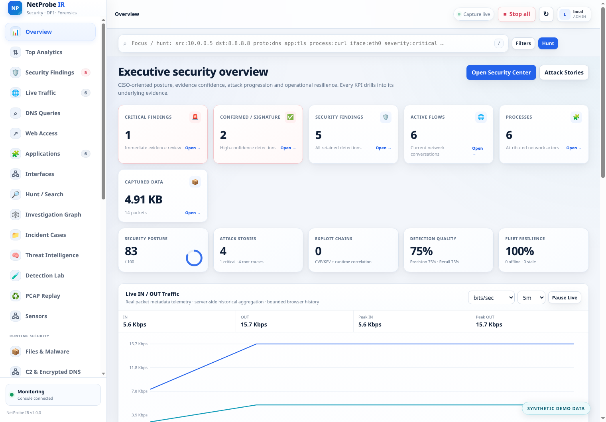
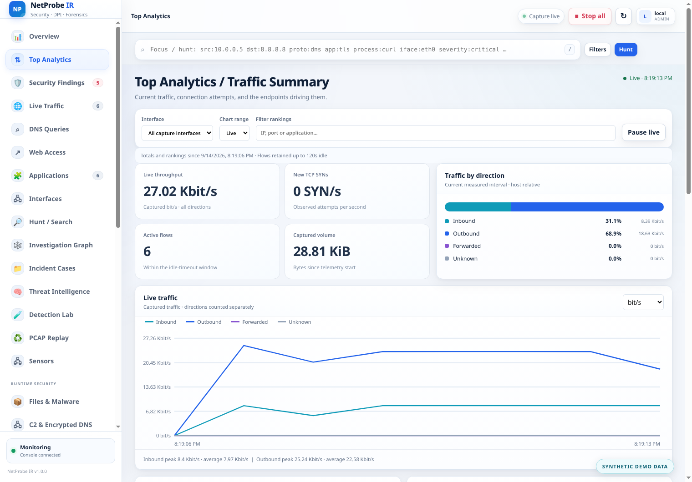
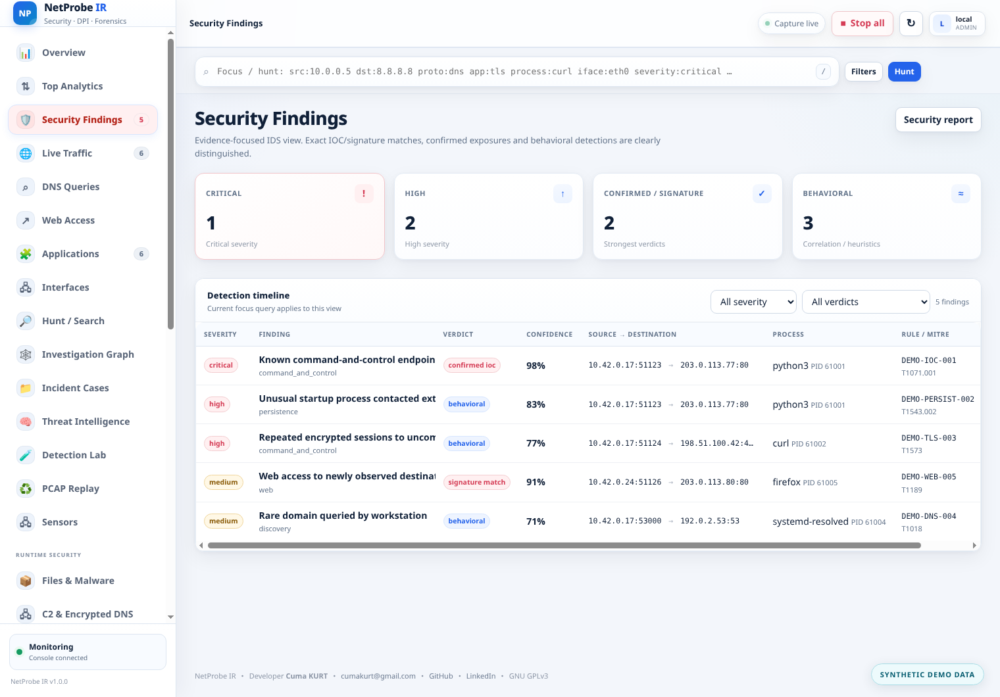
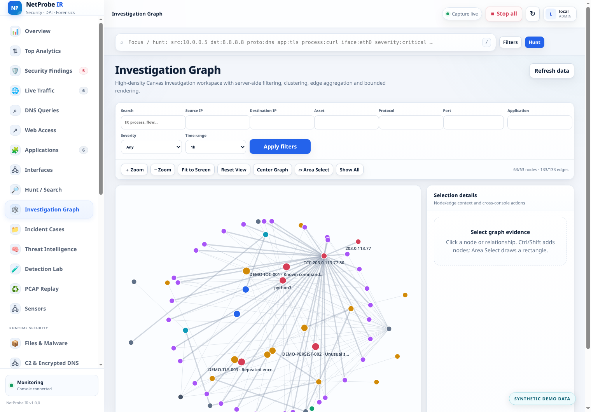
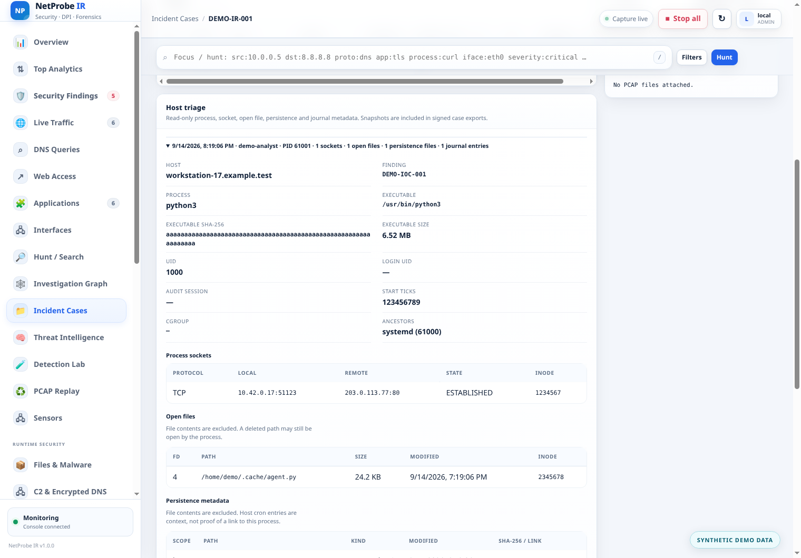

# NetProbe IR — Linux Network Forensics & Runtime Network Observability

**Türkçe** · [English](README.md) · [Dokümantasyon](docs/README_TR.md)

NetProbe IR, Linux üzerinde çalışan **host tabanlı ağ adli analiz, canlı trafik görünürlüğü ve proses-ağ korelasyonu** aracıdır. Tasarım hedefi yalnızca “hangi IP hangi porta bağlandı?” sorusunu cevaplamak değil; mümkün olduğunda aşağıdaki zinciri tek bir olay modeli içinde kurmaktır:

```text
paket → flow → socket → PID → executable → kullanıcı/cgroup/container
      → uygulama protokolü → davranış/anomali → PCAP kanıtı → rapor
```

Bu paket, harici runtime kütüphanesi gerektirmeyen **statik Linux binary** içerir. Paket yakalama, `/proc` tabanlı proses korelasyonu, yerleşik DPI, canlı web arayüzü, WebSocket telemetri, açıklanabilir anomali kuralları, dönen PCAPNG “flight recorder” ve HTML/JSON raporlama aynı uygulama içinde çalışır.

> **Güvenlik ve yetkilendirme:** NetProbe IR yalnızca sahibi olduğunuz veya izlemek için açık yetkinizin bulunduğu sistem ve ağlarda kullanılmalıdır. PCAP dosyaları kimlik bilgileri, oturum verileri, kişisel veriler veya ticari sırlar içerebilir.

---

## Proje bilgileri

| Alan | Bilgi |
|---|---|
| Proje | NetProbe IR |
| Sürüm | 1.0.0 |
| Geliştirici | **Cuma KURT** |
| E-posta | **cumakurt@gmail.com** |
| LinkedIn | https://www.linkedin.com/in/cuma-kurt-34414917/ |
| Kaynak kod / Repository | https://github.com/cumakurt/netprobe-ir |
| Lisans | **GNU General Public License v3 — GPL-3.0-only** |

Binary içinden de aynı bilgiyi görebilirsiniz:

```bash
netprobe-ir --about
```

Tam GPLv3 metni `LICENSE`, telif/lisans özeti `COPYRIGHT`, geliştirici bilgileri `AUTHORS` dosyasındadır.

## Ürün turu

Aşağıdaki görüntüler, yalıtılmış bir ağ ortamında **sentetik örnek verilerle** açılan güncel v1.0.0 web konsolundan alınmıştır. Adresler ve alan adları dokümantasyon örnekleridir; bulgular gerçek bir olaya ait değildir. Her görüntü **SYNTHETIC DEMO DATA** etiketi taşır.

### Yönetici genel görünümü

<p align="center">
  
</p>

### Top Analytics / Traffic Summary

<p align="center">
  
</p>

### Güvenlik bulguları ve inceleme grafiği

<p align="center">
  
</p>

<p align="center">
  
</p>

### Olay dosyası ve host triage

<p align="center">
  
</p>

<details>
<summary>Diğer konsol görüntüleri</summary>

- [Trafik inceleme sıralamaları](img/traffic-rankings.png)
- [Canlı akış tablosu](img/live-traffic.png)
- [Saldırı hikâyeleri](img/attack-stories.png)
- [Tespit kalitesi](img/detection-quality.png)
- [Olay dosyası genel görünümü](img/incident-case.png)

</details>

Tüm görüntüler, `scripts/capture-readme-screenshots.sh` çalıştırılarak yalıtılmış sentetik veri kümesinden yeniden üretilebilir. Betik, bütün görüntüler başarıyla oluşturulup doğrulandıktan sonra `img/` içeriğini değiştirir.


## v1.0.0 Production Investigation, Notifications ve Live Traffic

v1.0.0; yüksek yoğunluklu investigation kullanımı, context-aware asset pivotları, güvenli notification yönetimi ve gerçek telemetry tabanlı IN/OUT trafik görünürlüğüne odaklanan production-readiness kilometre taşıdır. İkinci capture/auth/event altyapısı kurmaz; mevcut pipeline, Event Bus, RBAC ve audit katmanlarını kullanır.

### Interaktif Investigation Graph

- DOM yerine Canvas rendering;
- wheel/trackpad zoom, pan, Fit to Screen, Reset View, Center Graph;
- tek seçim, Ctrl/Command/Shift multi-select ve rectangle selection;
- seçili node'ları birlikte taşıma ve session boyunca position persistence;
- node/edge hover ve detail panel;
- source/destination IP, asset, protocol, port, application, severity ve time-range filtreleri;
- server-side filter, neighborhood focus, clustering, edge aggregation ve bounded node/edge output;
- Traffic, Flows, Security Findings ve Assets ekranlarına context-aware navigation.

### Dinamik Assets

Asset kayıtları tıklanabilir ve yalnız gerçekten gözlenen telemetry alanlarını gösterir: IP/name, process/user/container/pod/interface identity, first/last seen, IN/OUT/total traffic, flow count, protocols, ports, related findings ve related assets. Telemetride olmayan MAC/hostname fake üretilmez.

### Notification Management

System Settings altında Email/SMTP ve Telegram kanalları bağımsız severity routing ile yönetilir. SMTP clear-text, STARTTLS ve implicit TLS/SSL, recipient list, timeout ve test gönderimini; Telegram bot token, chat ID, timeout ve test mesajını destekler. Delivery bounded async queue, finite retry, exponential backoff, cooldown/dedup ve drop/failure/success metric'leriyle çalışır. SMTP password ve Telegram token disk üzerinde encrypted tutulur, normal API/UI response'larında maskelenir ve loglara yazılmaz.

### Gerçek Live IN / OUT Traffic

Overview grafiği mevcut packet-metadata Event Bus'tan beslenir. Server bounded 1-second buckets ve 1m/5m/15m/1h/24h downsampled history tutar. UI bits/sec, bytes/sec, packets/sec, flows/sec, current/peak değer, hover detail ve backend capture'ı durdurmadan UI-only Pause/Resume destekler.

### Release qualification

Go unit/integration, tüm repository race detector, local/mock SMTP/Telegram, 5.000-flow graph bound, live-traffic downsampling, gerçek Chromium E2E, gerçek Linux capture/IDS/Hunt ve gerçek TLS SNI/ALPN/JA3/JA4/NPSH regression testleri uygulanmıştır. Ayrıntılar `docs/ADVANCED_V10_TR.md` ve `TEST-RESULTS_TR.md` içindedir.

## v0.9.0 birlikte çalışabilirlik, CISO görünümü ve response automation

v0.9.0, v0.8.1 detection-quality/root-cause katmanını koruyarak event standardizasyonu, detection interoperability, response playbook ve yönetici odaklı investigation katmanı ekler. Amaç daha fazla alarm üretmek değil; yüksek hacimli packet/runtime/detection telemetrisini daha az sayıda ve daha açıklanabilir incident'e dönüştürmektir.

### CISO odaklı Overview ve Unified Investigation

- Overview altındaki **Interface Acquisition kaldırıldı**. Interface acquisition/health ayrıntıları Interfaces ve yeni **SOC Performance** sayfasındadır.
- En üstteki tüm KPI kartları tıklanabilir drill-down oldu. **Active Flows → Live Traffic**, finding KPI'ları → Security Findings, process/application KPI'ları → Applications, captured-data KPI'ları → trafik evidence görünümüne gider.
- Posture score, 24 saat risk trendi, evidence-confidence dağılımı, Attack Story/exploit/root-cause coverage, Detection Quality ve Fleet resilience kartları eklendi.
- Attack Story içinden graph, root-cause inference, risk timeline, file/runtime/exploit/TLS/DNS kanıtını bir arada gösteren **Unified Investigation Workspace** açılabilir.

### Canonical event ve detection interoperability

- finding/flow/runtime için **OCSF-compatible canonical envelope** (`/api/v1/ocsf`); eksiksiz OCSF uyumluluğu iddia edilmez.
- event/value count, temporal/ordered temporal, group-by/timespan/threshold destekli **Sigma correlation planı**.
- coverage ve `requires_review` üreten **Suricata/Snort import analyzer**; unsupported option sessizce kaybolmaz.

### Response Playbooks

- `dry_run`, `approval_required`, açıkça seçilen `automatic` modları.
- Severity/confidence/verdict/category/tag/YARA/KEV koşulları.
- Case, PCAP protection ve Active Response action'ları mevcut güvenlik kontrollerini tekrar kullanır; automatic mod allowlist veya global response ayarlarını bypass edemez.

### Historical analytics, asset ve infrastructure intelligence

- Time/type/severity/process/destination filtreli bounded historical event store.
- Host/package Asset Intelligence ve CycloneDX/SPDX çıktısı.
- Opsiyonel local CIDR ASN/organization/country enrichment.
- TLS certificate/SPKI clustering, SAN/self-signed/expiry ve IP/SNI/JA4 reuse bağlamı.
- DNS domain→IP graph, churn/diversity ve fast-flux-like bağlam.
- `memfd_create`, `ptrace`, deleted/temp execution ve gözlenebilen namespace/mount/capability event'leri için runtime anomaly detection.

### eBPF, performans, Profiles ve supply-chain

- Auditable **CO-RE eBPF source/build/readiness** yolu ile mevcut bpftrace ve `/proc` fallback korunur. Release hostunda BTF/libbpf/bpftool olmadığı için native CO-RE live pass iddia edilmez.
- **SOC Performance** ekranında acquisition error/drop, recorder/export pressure, interface health, runtime-sensor readiness ve bounded synthetic benchmark.
- Detection/response karar yolunun dışında experimental OpenTelemetry Profiles adapter.
- CycloneDX/SPDX SBOM, provenance, SHA-256 manifest, `SOURCE_DATE_EPOCH` desteği ve opsiyonel Ed25519 release-manifest imzası.

Multi-tenant izolasyon kullanıcı isteği doğrultusunda hâlâ kapsam dışıdır. Ayrıntılar `docs/ADVANCED_V09_TR.md` dosyasındadır.

## v0.8.1 Detection Quality & Root-Cause Release

v0.8.1, responsive v0.8 konsolunu koruyup Detection Quality, Attack Story v2, probable root-cause inference, Sigma v2, CVE/KEV exploit correlation, C2 Analytics v2 ve Fleet Health v2 ekledi.

## v0.8.0 korelasyon, Sigma ve konsol tasarım yenilemesi

v0.8.0, v0.7 runtime-security katmanını aynen koruyup üç alana odaklanır: **daha güçlü operatör iş akışı**, **kural taşınabilirliği** ve dar laptop ekranından geniş SOC ekranına kadar kendini daha iyi ölçekleyen **daha anlaşılır bir web konsolu**.

### Güvenlik ve analiz ekleri

- mevcut runtime-attribution katmanı üzerinde daha açık **eBPF/runtime capability** görünürlüğü;
- `netprobe sigma --in rule.yml --format query|npdl` komutuyla NetProbe hunt sorgusuna veya başlangıç NPDL içeriğine çevrilebilen **Sigma alt-küme çevirisi**;
- v0.7 ile gelen **CVE/KEV exposure correlation**, Detection Lab, Attack Stories ve Fleet iş akışlarının v0.8 omurgası olarak devamı;
- istek doğrultusunda bu sürümde hâlâ **multi-tenant izolasyon** eklenmemiştir.

### Web konsolu ve UX yenilemesi

- beyaz tema korunurken daha iyi **renk kontrastı**, ikonlar, emoji destekli menü ve kart hiyerarşisi;
- geniş ekranlarda yatay alanı daha iyi kullanan daha akışkan sayfa yerleşimi;
- KPI/kart/operasyon panellerinde daha doğal yeniden boyutlanma için `auto-fit` grid’ler;
- dar pencerelerde overlay sidebar, kapatma düğmesi, sticky focus bar ve daha esnek top bar;
- Fleet, Stories, Lab, Operations ve streaming/export görünümlerinde API’yi değiştirmeden görsel iyileştirmeler.

## v0.7.0 gelişmiş analiz, malware evidence ve genişletilebilirlik

v0.7.0, v0.6 Remote Syslog/Flow Export katmanını ve önceki capture/DPI/IDS/Hunt/SOC mimarisini aynen koruyarak yeni bir **runtime-security ve investigation** katmanı ekler. Amaç yalnız “hangi trafik geçti?” sorusunu değil; “hangi process/file/identity bu trafiği oluşturdu, hangi güvenlik bağlamına oturuyor ve hangi kanıt korunmalı?” sorusunu da cevaplamaktır.

### Network file ve malware evidence

- desteklenen HTTP/1 download, SMTP/MIME attachment, FTP data transfer ve SMB2 write akışlarından bounded file reconstruction;
- artifact başına SHA-256/SHA-1/MD5, MIME, boyut ve Shannon entropy;
- opsiyonel dış `yr` binary üzerinden asynchronous **YARA-X** taraması;
- YARA eşleşmelerinin flow/process/Attack Story/Investigation Graph bağlamıyla yüksek güvenli Security Finding'e dönüşmesi;
- **Files & Malware** web workspace ve file → flow → process → hash/YARA drill-down;
- Smart-PCAP `headers`, `metadata` veya `drop` retention seçtiğinde file reconstruction yolundan ikinci bir payload saklama kanalı oluşmaması.

### Semantic detection ve protokol kapsamı

- **NPDL — NetProbe Detection Language**: process/flow/packet/TLS/HTTP/file alanlarını kullanan, bilinçli olarak Turing-complete olmayan detection scripting dili;
- cleartext HTTP/2 (`h2c`) preface ve SETTINGS metadata;
- QUIC long-header/version/DCID/SCID/Retry/version-negotiation metadata ve HTTP/3 transport classification; encrypted QPACK header görünürmüş gibi gösterilmez;
- `core`, `enterprise`, `database`, `devops`, `ics` protocol pack'leri;
- Kerberos, LDAP, SMB, RDP, Redis, PostgreSQL, MySQL, Modbus/TCP, DNP3, Siemens S7/ISO-on-TCP ve BACnet/IP için signature/port-aware sınıflandırma;
- lateral movement ve NTLM authentication fan-out korelasyonu;
- process allowlist destekli DoT/DoQ/DoH/DoH-like encrypted-DNS intelligence;
- process/user/container/pod/service identity baseline;
- median interval, relative MAD/jitter, transfer-size similarity ve periodicity kullanan açıklanabilir C2 beacon analizi.

### Vulnerability, streaming, fleet ve plugin katmanı

- dpkg/rpm/apk installed-package inventory ve CISA-KEV uyumlu katalog; package/product isim eşleşmesi **exposure context** olarak gösterilir, o sürümün kesin vulnerable olduğu iddia edilmez;
- OTLP/HTTP Logs, NATS Core, `kcat` üzerinden Kafka ve ClickHouse JSONEachRow streaming;
- per-invocation timeout/output limitli dış `wasmtime` WASI plugin runner; NetProbe plugin'e filesystem/network preopen vermez;
- mevcut sensor federation üzerinde fleet command queue/poll/ack;
- watched-file hash/deletion, low-disk ve clock rollback için self-protection;
- deterministik local ve opsiyonel OpenAI-compatible remote modlu evidence-based Analyst. Analyst hiçbir zaman IDS/response karar yolunun parçası değildir.

### Opsiyonel bağımlılıklar

NetProbe binary statik kalır. İleri entegrasyonların bazıları capability bazlıdır:

| Özellik | Opsiyonel araç |
|---|---|
| YARA-X | `yr` |
| WASM plugin | `wasmtime` |
| Kafka streaming | `kcat` |
| eBPF attribution | `bpftrace` + uyumlu kernel/yetki |
| Active response | ör. `nft` + gerekli privilege |

Opsiyonel binary yoksa ana capture/DPI/IDS/Web UI durmaz; yalnız ilgili capability unavailable/degraded görünür.

Ayrıntılı v0.7 güvenlik modeli, config alanları ve bilinçli sınırlar için `docs/ADVANCED_V07_TR.md` dosyasına bakın.

## v0.6.0 standart Remote Syslog ve Flow Export katmanı

v0.6.0, v0.5 kimlik doğrulama/SOC ve v0.4 sensör/forensics özelliklerini koruyarak dış SIEM ve flow collector sistemlerine gerçek zamanlı, non-blocking export ekler:

- **System Settings / Sistem Ayarları** altında birden fazla bağımsız Remote Syslog hedefi;
- UDP, TCP ve TLS Syslog; RFC3164, RFC5424, RFC5425 güvenli yol ve RFC6587 octet-counting/non-transparent framing;
- CA doğrulaması, custom CA ve opsiyonel mTLS; private-key bilgileri normal API cevaplarından redakte edilir;
- ham payload yerine yapılandırılmış `security`, `network`, `flow`, `dpi`, `dns`, `http`, `tls`, `anomaly`, `system` event kategorileri;
- aynı anda birden fazla NetFlow v5/v9, IPFIX/v10 ve sFlow v5 collector;
- v9/IPFIX/sFlow için IPv4/IPv6, template refresh, Observation Domain, source-interface filtresi, sampling, active/inactive timeout;
- collector double-count oluşmaması için unidirectional NetFlow/IPFIX ve active-timeout sayaç deltaları;
- canlı packet metadata üzerinden gerçek sFlow packet sampling;
- bounded queue, non-blocking event bus, drop/reconnect/backoff metrikleri;
- mevcut auth/RBAC/audit ile korunan CRUD/test API'leri, persistence, web health kartları ve Prometheus metrikleri.

Ayrıntılı protokol, güvenlik, API, persistence ve test dokümanı: `docs/EXPORT_SYSLOG_FLOW_TR.md`.

## v0.5.0 güvenlik ve SOC operasyon katmanı

v0.5.0, v0.4.0 sensör/forensics temelini değiştirmeden yönetim düzlemini güvenli ve çok kullanıcılı hale getirir. Başlıca yenilikler:

- varsayılan `admin` kullanıcısı ve `install.sh` tarafından bir kez gösterilen rastgele bootstrap parola; ilk girişte zorunlu parola değişimi,
- PBKDF2-HMAC-SHA256 parola saklama, brute-force lockout, session idle/absolute timeout ve session revoke,
- `HttpOnly` + `SameSite=Strict` session cookie ve mutating session isteklerinde same-origin/CSRF koruması,
- uzun ömürlü WebSocket bağlantılarında sürekli authorization revalidation,
- `admin / responder / analyst / viewer` RBAC ve son aktif administrator koruması,
- TOTP MFA + tek kullanımlık recovery code,
- TTL/scoped API token oluşturma ve revoke,
- OIDC Authorization Code + PKCE / RS256-JWKS SSO,
- HMAC-SHA256 zincirli tamper-evident Audit Trail,
- iki-person Active Response approval,
- Attack Stories, MITRE ATT&CK, Asset Identity, Time Machine ve baseline diff,
- Detection Tuning / süreli suppression,
- webhook ve CEF/LEEF syslog entegrasyonları,
- AES-256-CTR + HMAC-SHA256 authenticated encrypted backup/restore,
- console CIDR lockdown, signed-config kontrolleri ve forensic immutable case koruması.

Kimlik doğrulama ve operasyon güvenliği için `docs/AUTH_SECURITY_TR.md` dosyasına bakın.

### v0.4.0 sensör/forensics temeli


v0.3 IDS/Hunt konsoluna ek olarak v0.4.0 şu yetenekleri getirir:

- pasif yüksek hızlı `TPACKET_V3/PACKET_MMAP` capture ve otomatik AF_PACKET fallback; AF_XDP yeteneği raporlanır ancak inline forwarding tasarımı olmadan host trafiğini tüketebileceği için pasif redirect bilinçli olarak etkinleştirilmez,
- isteğe bağlı `bpftrace` tabanlı eBPF attribution event’leri ve eBPF aracı/yetkisi yoksa otomatik `/proc` fallback,
- aynı decode/DPI/IDS/Hunt pipeline’ı üzerinden offline PCAP/PCAPNG Replay,
- JA4 client fingerprint, NetProbe TLS Server Fingerprint (NPSH), QUIC long-header metadata/fingerprint ve gözlemlenebilen TLS sertifika metadata’sı,
- STIX 2.1 dosya importu ve TAXII 2.1 threat-intelligence toplama,
- proses farkındalıklı davranış baseline motoru,
- Incident Case, analist notu, kanıt toplama ve imzalı evidence ZIP export,
- proses/flow/IP/domain/TLS/interface/finding ilişkilerini gösteren Investigation Graph,
- `draft → test → enabled → deprecated` yaşam döngülü Detection Lab ve Ed25519 rule-pack imzaları,
- varsayılan dry-run, allowlist, TTL rollback ve açık `APPLY` onayı kullanan kontrollü Active Response,
- PCAP kanıtını varsayılan olarak sensörde bırakan distributed sensor/federation modeli.

Offline analiz için `netprobe-ir replay <capture.pcapng>`, kural bütünlüğü için `netprobe-ir rules sign|verify` kullanılabilir. Doğrulanmış sınırlar için `docs/IMPLEMENTATION_STATUS_TR.md` dosyasına bakın.

---

## 1. Hızlı başlangıç

Paket açıldıktan sonra en kolay kurulum:

```bash
chmod +x install.sh uninstall.sh
sudo ./install.sh
```

Kurulum tamamlandığında varsayılan web arayüzü:

```text
http://127.0.0.1:8443
```

Systemd kullanan sistemlerde:

```bash
systemctl status netprobe-ir
journalctl -u netprobe-ir -f
```

Binary doğrudan da çalıştırılabilir:

```bash
sudo ./dist/netprobe-linux-amd64
```

ARM64:

```bash
sudo ./dist/netprobe-linux-arm64
```

---

# 2. Universal `install.sh`

`install.sh` özellikle dağıtım bağımlılığını azaltacak biçimde tasarlanmıştır. NetProbe IR binary’si statik olduğu için normal kurulumda libpcap, OpenSSL, nDPI, Node.js, npm, Python veya Go runtime **gerekmez**.

Kurulum scriptinin yaptığı işlemler sırayla:

1. Linux işletim sistemini doğrular.
2. CPU mimarisini algılar: `amd64/x86_64` veya `arm64/aarch64`.
3. `/etc/os-release` üzerinden dağıtım bilgisini okur.
4. Kurulum için gerekli temel POSIX araçlarını doğrular.
5. Paket içindeki uygun statik binary’yi seçer.
6. `dist/SHA256SUMS` mevcutsa binary SHA-256 değerini doğrular.
7. Paket binary’si bulunmuyorsa GitHub release üzerinden indirme fallback’i kullanabilir.
8. İndirme aracı yoksa paket yöneticisini algılayıp yalnızca gereken minimum `curl + ca-certificates` paketlerini kurmaya çalışır.
9. Binary, config, data ve dokümantasyon dizinlerini kurar.
10. Init sistemini algılar ve servis entegrasyonunu yapar.
11. Uygulamayı etkinleştirir/başlatır.
12. Kurulan binary üzerinde `--self-test` çalıştırır.

Kurulum ekranı paket yöneticilerinin yüzlerce satırlık çıktısını normalde ekrana basmaz. Bunun yerine:

```text
[1/8] Inspecting operating system and architecture
[✓] Debian GNU/Linux 13 · architecture amd64

[2/8] Checking runtime and installer requirements
[✓] Static binary requires no runtime libraries; SHA-256 verification is available.
...
[✓] Embedded functional self-test passed.
```

şeklinde kısa fakat anlamlı durum bilgisi gösterir. Bir hata oluşursa yalnızca hatanın özeti ve tanı için kurulum logunun son satırları gösterilir.

## 2.1 Desteklenen init sistemleri

Installer aşağıdaki servis yöneticilerini otomatik algılar:

| Init sistemi | Entegrasyon |
|---|---|
| systemd | `/etc/systemd/system/netprobe-ir.service` |
| OpenRC | `/etc/init.d/netprobe-ir` + `/etc/conf.d/netprobe-ir` |
| runit | `/etc/sv/netprobe-ir/run` |
| SysV init | `/etc/init.d/netprobe-ir` |
| Bilinmeyen/custom init | Binary/config kurulur; manuel başlatma bilgisi verilir |

NetProbe IR statik binary olduğu için dağıtımın glibc veya musl kullanması uygulama runtime’ı açısından zorunlu bir fark yaratmaz. Ancak sistemde Linux `AF_PACKET`, procfs ve ilgili kernel izinlerinin bulunması gerekir.

## 2.2 Paket yöneticisi algılama

Paket içindeki binary mevcutsa paket yöneticisine ihtiyaç yoktur. Binary’nin GitHub’dan indirilmesi gereken fallback senaryosunda installer aşağıdaki yöneticileri tanıyabilir:

```text
apt-get
DNF
yum
zypper
pacman
apk
xbps-install
emerge
eopkg
```

Amaç dağıtıma gereksiz paket yüklemek değildir. Örneğin `curl` veya `wget` zaten varsa hiçbir ek paket kurulmaz.

## 2.3 Installer seçenekleri

```bash
./install.sh --help
```

Başlıca seçenekler:

```text
--yes, -y          unattended/package-manager işlemleri için
--no-start         servisi kur fakat başlatma
--no-enable        boot sırasında otomatik başlamayı etkinleştirme
--force-config     mevcut config'i yedekleyip örnek config ile değiştir
--bundled-only     yalnızca paket içindeki binary'yi kullan; indirme yapma
--download-only    bundled binary'yi atla, GitHub release kullan
--root <path>      staging/test root altına kur; gerçek servisi başlatma
```

Örnekler:

```bash
sudo ./install.sh
```

Servisi başlatmadan:

```bash
sudo ./install.sh --no-start
```

Mevcut config’i korur. Config’i yeni örnekle bilinçli biçimde değiştirmek için:

```bash
sudo ./install.sh --force-config
```

Eski dosya zaman damgalı olarak saklanır:

```text
/etc/netprobe-ir/config.json.bak.YYYYMMDDHHMMSS
```

Ağ erişimini tamamen kapatıp yalnızca ZIP içindeki binary’yi kabul etmek için:

```bash
sudo ./install.sh --bundled-only
```

---

# 3. `uninstall.sh`

Normal kaldırma:

```bash
sudo ./uninstall.sh
```

Bu işlem:

- servisi durdurur,
- boot aktivasyonunu kaldırır,
- systemd/OpenRC/runit/SysV servis dosyalarını temizler,
- `/usr/local/sbin/netprobe-ir` binary’sini kaldırır,
- `/usr/local/sbin/netprobe` uyumluluk alias’ını kaldırır,
- kurulu dokümantasyonu kaldırır,
- **config ve forensic veriyi varsayılan olarak korur**.

Korunan yollar:

```text
/etc/netprobe-ir/
/var/lib/netprobe-ir/
```

Tamamen silmek için açıkça `--purge` gerekir:

```bash
sudo ./uninstall.sh --purge
```

Non-interactive tam silme:

```bash
sudo ./uninstall.sh --purge --yes
```

`--purge`, PCAP/incident/report dosyalarını da geri dönüşsüz sileceği için varsayılan değildir.

---

# 4. Kurulum sonrası dosya yerleşimi

```text
/usr/local/sbin/netprobe-ir             ana binary
/usr/local/sbin/netprobe                uyumluluk symlink'i
/etc/netprobe-ir/config.json            ana config
/var/lib/netprobe-ir/                   çalışma/forensic veri dizini
/usr/local/share/doc/netprobe-ir/       README, LICENSE, test/mimari dokümanları
```

Data dizini altında runtime sırasında tipik olarak:

```text
/var/lib/netprobe-ir/
├── pcap/               dönen PCAPNG flight-recorder segmentleri
├── incidents/          alarm anında korunmuş PCAPNG kanıtları
└── reports/            kapanışta üretilen HTML/JSON raporları
```

---

# 5. Uygulama neyi analiz eder?

Her flow için mevcut olduğu ölçüde:

- capture interface’i,
- Ethernet ve VLAN bilgisi,
- IPv4 / IPv6,
- TCP / UDP / ICMP / ICMPv6,
- local ve remote endpoint,
- ingress / egress yönü,
- ilk ve son görülme zamanı,
- TX/RX paket sayısı,
- TX/RX byte sayısı,
- TCP flag bilgileri,
- PID ve PPID,
- UID ve kullanıcı adı,
- process adı,
- executable yolu,
- command line,
- cgroup,
- best-effort container metadata,
- attribution yöntemi,
- uygulama protokolü,
- DPI confidence,
- uygulama metadata’sı,
- risk puanı,
- risk nedenleri,
- alarm ilişkisi

gösterilebilir.

Örnek mantıksal akış:

```text
TCP 10.10.20.15:49152 → 203.0.113.40:443
Process      : python3
PID          : 28417
Executable   : /usr/bin/python3
Attribution  : local-socket
DPI          : TLS
TLS version  : TLS 1.3
SNI          : api.example.org
ALPN         : h2
JA3          : ...
TX           : 84 MiB
RX           : 220 KiB
Risk         : 82
Reasons      : high outbound volume + unusual fan-out
```

---

# 6. Paket yakalama katmanı

Mevcut doğrulanmış backend Linux `AF_PACKET/SOCK_RAW` kullanır. Her seçilen interface için raw capture socket açılır.

Desteklenen temel katmanlar:

- Ethernet II
- 802.1Q VLAN
- 802.1ad QinQ/VLAN stacking
- IPv4
- IPv6
- yaygın IPv6 extension header’ları
- TCP
- UDP
- ICMP
- ICMPv6

Capture pipeline bounded queue kullanır. İşleyici trafiği yetiştiremezse paket kaybını sessizce gizlemek yerine drop/error sayaçlarında görünür hale getirir.

Web UI’daki capture health bu nedenle önemlidir.

---

# 7. Interface seçimi

Varsayılan durumda uygulama uygun UP interface’leri keşfeder.

Tek interface:

```bash
sudo netprobe-ir --interface eth0
```

Birden fazla:

```bash
sudo netprobe-ir --interface eth0 --interface wg0
```

veya:

```bash
sudo netprobe-ir --interface eth0,wg0,docker0
```

Container/bridge/VPN topolojilerinde aynı mantıksal trafiğin birden fazla interface’te görülebileceğini unutmayın. Topoloji farkındalığı sınırlıdır; `docs/IMPLEMENTATION_STATUS_TR.md` hedef backend farklarını açıklar.

---

# 8. Process / socket attribution

Proses korelasyonu aşağıdaki Linux kaynaklarını birleştirir:

```text
/proc/net/tcp
/proc/net/tcp6
/proc/net/udp
/proc/net/udp6
/proc/<pid>/fd/* → socket:[inode]
```

Socket inode üzerinden PID bulunur; ardından:

```text
/proc/<pid>/status
/proc/<pid>/exe
/proc/<pid>/cmdline
/proc/<pid>/cgroup
```

bilgileriyle enrichment yapılır.

Attribution yöntemleri:

| Değer | Anlamı |
|---|---|
| `exact-socket` | 5-tuple’a en güçlü eşleşme |
| `local-socket` | local endpoint/socket eşleşmesi |
| `wildcard-listener` | wildcard listener üzerinden eşleşme |
| `forwarded` | trafik host üzerinde route/bridge edilmiş; local PID beklenmez |
| `socket-not-mapped` | socket/PID eşleşmesi bulunamadı |

Kısa ömürlü socket’leri kaçırmamak için periyodik snapshot’a ek olarak throttle edilmiş hızlı refresh uygulanır.

### Attribution neden bulunamayabilir?

- proses flow görülmeden önce kapanmış olabilir,
- `/proc` `hidepid` ile kısıtlanmış olabilir,
- Yama/ptrace policy kısıtlayabilir,
- PID namespace farkı olabilir,
- trafik local process’e ait değil forward edilmiş olabilir,
- çok kısa ömürlü UDP akışı snapshot penceresinden kaçabilir.

NetProbe IR eşleşme yoksa sahte PID üretmez.

---

# 9. Yerleşik DPI

v0.4.0 bağımlılıksız DPI motoru aşağıdakileri destekler:

### HTTP/1.x

- request başlangıç satırı,
- response başlangıç satırı,
- method,
- path,
- Host,
- User-Agent,
- Content-Type.

### DNS

- UDP DNS,
- TCP DNS,
- query,
- temel cevap ayrıştırma,
- A,
- AAAA.

### TLS ClientHello

- TLS ClientHello tespiti,
- SNI,
- ALPN,
- supported version,
- cipher/extension metadata,
- standart JA3,
- NetProbe kısa TLS fingerprint.

### SSH

- SSH banner tespiti.

### Diğer sınıflandırmalar

- QUIC/HTTP3 için encrypted/port heuristic,
- SMTP,
- MySQL,
- PostgreSQL,
- RDP vb. için bazı port hint’leri.

## TLS konusunda önemli sınır

TLS 1.2/1.3 içindeki şifreli HTTP payload’ı anahtar olmadan açık metin değildir. NetProbe IR:

```text
SNI
ALPN
JA3
TLS version
packet size/timing
flow behavior
```

gibi görünür metadata’yı kullanır; şifreli payload’ı çözülmüş gibi göstermez.

---

# 10. TCP stream reconstruction

DPI parser yalnızca tek pakette tam application message geleceğini varsaymaz. TCP başlangıç verisi yön bazında sınırlı bir buffer içinde birleştirilir.

Özellikler:

- in-order birleştirme,
- yaygın out-of-order başlangıç segmentleri için bounded pending map,
- `dpi.max_stream_bytes` ile flow başına bellek sınırı.

Bu, parçalanmış HTTP header veya TLS ClientHello gibi durumlarda parser güvenilirliğini artırır.

---

# 11. Anomali motoru

v0.4.0 “black box AI skorlaması” yerine açıklanabilir kurallar kullanır.

Mevcut kurallar:

- yüksek outbound byte hacmi / muhtemel exfiltration,
- kısa sürede yüksek destination fan-out,
- çok sayıda remote port/endpoint erişimi / scan davranışı,
- connection burst,
- periyodik beaconing,
- yüksek entropy DNS query.

Amaç yalnızca:

```text
Risk = 80
```

demek değildir. Flow üzerinde nedenler de bulunur:

```text
Risk 80
- periodic connection interval 10.0s with 0.0% jitter
- process contacted 52 unique destinations in 60s
```

Eşikler `config.json` içinden değiştirilebilir.

---

# 11A. Gelişmiş yerleşik IDS ve Security Findings

NetProbe IR v0.4.0, anomaly skor motorundan ayrı çalışan ikinci bir güvenlik katmanı içerir. **Native IDS**; TCP flag imzaları, bounded payload/application imzaları, stateful connection/DNS korelasyonu, network boundary policy ve operatörün verdiği IOC verisini birlikte değerlendirir. Sonuçlar web arayüzündeki ayrı **Security Findings** alanında hemen görünür ve attribution mevcutsa paket → flow → interface → PID/executable zincirine bağlanır.

En önemli tasarım ilkesi severity ile kesinliği birbirine karıştırmamaktır:

```text
severity   = gözlemin muhtemel etkisi/aciliyeti
verdict    = hangi kanıt türünün bulguyu ürettiği
confidence = gözlenen paterne güven 0..100
```

| Verdict | Ne ifade eder? |
|---|---|
| `confirmed_ioc` | operatörün konfigüre ettiği IOC ile exact eşleşme; IOC kaynağının doğruluğunu bağımsız olarak doğrulamaz |
| `signature_match` | deterministik paket/application paterni eşleşti; paterni doğrular, exploit'in başarılı olduğunu tek başına ispatlamaz |
| `confirmed_exposure` | cleartext authentication gibi doğrudan gözlenen riskli durum |
| `policy_exposure` | local mimariyle doğrulanması gereken yüksek riskli boundary/policy durumu |
| `behavioral` | stateful heuristic/korelasyon eşiği; analist doğrulaması gerekir |

Built-in kapsama TCP NULL/XMAS/SYN+FIN/SYN+RST, stateful multi-port scan/host sweep, Log4Shell-style JNDI, Shellshock, traversal, SQLi, command injection ve reverse-shell/EncodedCommand, scanner User-Agent, cleartext HTTP Basic/FTP/Telnet/mail authentication, Internet'e SMB, dışarıdan RDP, DNS tunneling/NXDOMAIN, cleartext HTTP üzerinden executable/script, büyük ICMP tunneling davranışı ve exact IP/domain/SNI/JA3 IOC eşleşmeleri dahildir.

Tam kural kataloğu, verdict anlamları, IOC formatı, custom JSON rule sistemi ve sınırlar **`docs/IDS_SECURITY_TR.md`** içinde ayrıntılıdır. `configs/iocs.example.json` ve `configs/ids-rules.example.json` hazır örneklerdir.

Önemli: `signature_match` desenin görüldüğünü; `confirmed_ioc` ise operatörün verdiği IOC verisiyle exact eşleşmeyi doğrular. Bunların hiçbiri tek başına “sistem kesin ele geçirildi” iddiası değildir.

---

# 12. Flight Recorder / PCAPNG

PCAP kaydı etkinse paketler:

```text
<data_dir>/pcap/
```

altında dönen PCAPNG segmentlerine yazılır.

Varsayılan:

```text
segment_mb  = 64 MiB
max_disk_mb = 1024 MiB
```

Disk bütçesi aşılırsa eski segmentler silinir.

High/critical alarm durumunda mevcut segment önce kapatılır; ardından son segmentlerin kopyası:

```text
<data_dir>/incidents/
```

altında tutulur. Segmentin kopyalanmadan önce düzgün kapatılması, PCAPNG blok bütünlüğünü korumaya yardımcı olur.

Recorder kapatma:

```bash
sudo netprobe-ir --no-recorder
```

PCAP dosyalarını hassas forensic kanıt kabul edin.

---

# 13. Web arayüzü — SOC/NOC tarzı beyaz konsol

Web UI doğrudan statik binary içine gömülüdür; ayrı Node.js, npm, nginx, Apache veya frontend runtime kurulumu gerekmez. Arayüz tamamen **beyaz tema**, yüksek kontrastlı tipografi ve olay anında tek bakışta anlaşılabilecek SOC/NOC bilgi hiyerarşisi ile yeniden tasarlanmıştır.

Varsayılan adres:

```text
http://127.0.0.1:8443
```

Sol menü aşağıdaki ana çalışma alanlarını içerir:

| Menü | Amaç |
|---|---|
| Overview | Capture sağlığı, anlık throughput, packet rate, flow/process/security özeti, protokol dağılımı ve öne çıkan prosesler |
| Security Findings | IDS/IOC/policy bulguları; verdict, confidence, MITRE ve forensic drill-down |
| Live Traffic | Flow ve son-paket metadata görünümü; arama, protokol filtresi ve drill-down |
| Applications | PID/executable/user bazlı trafik, hedef sayısı, flow ve risk görünümü |
| Alerts | Severity, rule, score, açıklama, proses, remote endpoint ve evidence ilişkisi |
| Interfaces | Interface bazında packet/byte/drop/error, bağımsız Start/Stop ve o interface’e ait flow/paketler |
| Hunt / Search | Sunucu taraflı cross-evidence arama ve Focus sorguları |
| Behavioral Alerts | Heuristic/anomaly motoru sonuçları |
| System | Capture Start/Stop, runtime health, HTML/JSON raporlar ve Prometheus metrikleri |

## 13.1 Overview grafik ve durum kartları

Overview ekranı açıldığında operatörün ilk birkaç saniyede aşağıdakileri görmesi hedeflenir:

- capture motoru çalışıyor mu / durmuş mu,
- TX/RX toplam throughput ve son yaklaşık iki dakikalık hız grafiği,
- saniyedeki paket oranı,
- aktif ve retained flow sayısı,
- proses sayısı,
- alarm ve kritik alarm sayısı,
- capture drop/error durumu,
- DPI protokol dağılımı donut grafiği,
- en çok trafik/risk üreten uygulamalar,
- son alarmlar,
- en güncel flow’lar.

Grafikler dekoratif sabit veriler değildir. WebSocket üzerinden gelen ardışık sayaç örneklerinden hesaplanır. Capture durdurulduğunda hız grafiği doğal olarak sıfıra iner ve UI bunu `Capture stopped` olarak açıkça gösterir.

## 13.2 Tıklanabilir drill-down modeli

Arayüz hash-route kullanan tek sayfalı konsol olarak çalışır. Böylece tarayıcının **Back / Forward** düğmeleri çalışır; her detay sayfasında breadcrumb ve geri dönüş butonu bulunur.

Tıklanabilir nesneler:

```text
Flow        → endpoint, L4/IP, interface, TX/RX, flags, attribution, DPI, process, risk reasons
Packet      → zaman, interface, yön, src/dst, protokol, frame boyutu, flags, flow, process, DPI
Application → PID/PPID, UID/user, executable, cmdline, cgroup/container, tüm flow’lar, hedefler, risk/alerts
Security    → severity, verdict, confidence, rule/category/MITRE, evidence, packet, flow, process, interface
Alert       → rule, severity, score, açıklama, evidence, PID, remote, ilişkili flow
Interface   → packet/byte/drop/error, o interface üzerindeki flow ve son paketler
```

Flow tablosundaki remote IP de tıklanabilir; Live Traffic ekranına o endpoint filtresiyle geçilebilir.

## 13.3 Paket görünürlüğü ve bellek sınırı

Web konsolu raw paket payload’larını sınırsız şekilde RAM’de tutmaz. Son **1000 paket** için bounded metadata ring-buffer kullanılır. Bu kayıtlar paket detay ekranını besler. Raw forensic byte’lar gerekiyorsa asıl kanıt kaynağı dönen PCAPNG flight recorder’dır.

Bu ayrım performans ve veri minimizasyonu için bilinçlidir:

```text
Web UI recent packet metadata  → hızlı drill-down
PCAPNG flight recorder         → raw packet forensic evidence
```

## 13.4 Arayüzden Start / Stop

Üst çubukta ve `System` ekranında capture kontrolü bulunur.

`Stop capture` davranışı **daemon prosesini veya web arayüzünü öldürmez**. Yalnızca AF_PACKET acquisition durur. Böylece mevcut flow/paket metadata’sı, raporlar ve web konsolu erişilebilir kalır. `Start capture` ile aynı daemon içinde yeniden capture başlatılır.

Bu tasarım bilinçlidir: bütün prosesi durdursaydık web portu da kapanacağı için aynı arayüzden tekrar Start vermek teknik olarak mümkün olmazdı.

Kontrol endpoint’leri yalnızca `POST` kabul eder ve normal API authentication katmanından geçer. Browser’dan gelen kontrol isteklerinde ayrıca same-origin kontrolü uygulanır; farklı bir origin’den loopback konsolunu durdurma/başlatma girişimi `403` ile reddedilir.

## 13.5 Interface bazında bağımsız Start / Stop

Her Linux interface kendi capture session'ına sahiptir. Interfaces ekranındaki **Stop interface**, yalnızca seçili interface'in AF_PACKET socket'ini kapatır; diğer interface'ler capture'a devam eder. **Start interface** aynı interface için yeni session başlatır. Global Start/Stop bütün session'ları yönetmeye devam eder. Her interface için state, start/stop timestamp, packet, byte, drop ve error ayrı gösterilir.

## 13.6 Focus filtreleri ve sunucu taraflı Hunt/Search

Global Focus alanı şu tip sorguları destekler:

```text
src:10.0.0.8 dst:1.1.1.1 proto:tcp app:tls process:curl
iface:eth0 dir:outbound severity:critical verdict:signature_match
rule:NP-IDS-1201 mitre:T1190
```

Alanlar: `src`, `dst`, `ip`, `sport`, `dport`, `port`, `proto`, `app`, `process`, `pid`, `iface`, `dir`, `severity`, `verdict`, `rule`, `mitre`, `category`. Advanced Filters drawer sayesinde query dilini bilmeyen kullanıcı source/destination/protocol/application/process/interface/direction/severity alanlarını formdan seçebilir.

Focus yalnızca soruşturma görünümünü daraltır; capture filtresi değildir ve çevresel PCAP kanıtını silmez. Hunt ekranı `/api/v1/hunt` kullandığı için arama sadece son WebSocket listesini değil daemon'ın retained evidence'ını tarar. Ayrıntı: `docs/HUNT_QUERY_TR.md`.

## 13.7 Responsive kullanım

Geniş ekranda sürekli sol menü ve çok kolonlu SOC görünümü kullanılır. Tablet/telefon genişliğinde sidebar açılır menüye dönüşür, kartlar tek/iki kolona iner ve tablolar yatay kaydırılabilir kalır. Böylece mobil görünüm için veri sütunları sessizce kaybedilmez.

Arayüz footer’ında geliştirici, e-posta, GitHub, LinkedIn ve GNU GPLv3 bilgisi bulunur.

---

# 14. REST API ve WebSocket

Mevcut endpoint’ler:

```text
GET /api/v1/status
GET /api/v1/flows?limit=500
GET /api/v1/flows/<flow-id>
GET /api/v1/packets?limit=300
GET /api/v1/packets/<packet-id>
GET /api/v1/processes
GET /api/v1/processes/<pid>
GET /api/v1/alerts?limit=500
GET /api/v1/findings?limit=1000
GET /api/v1/findings/<finding-id>
GET /api/v1/hunt?q=<query>&limit=500
GET /api/v1/graph
GET /api/v1/assets
GET /api/v1/assets/<url-encoded-id>
GET /api/v1/traffic/live
GET /api/v1/traffic/history?range=1m|5m|15m|1h|24h
GET /api/v1/notifications
PUT /api/v1/notifications
POST /api/v1/notifications/test/email
POST /api/v1/notifications/test/telegram
POST /api/v1/control/start
POST /api/v1/control/stop
POST /api/v1/control/interface/<url-encoded-interface>/start
POST /api/v1/control/interface/<url-encoded-interface>/stop
GET /api/v1/report.json
GET /api/v1/report.html
GET /metrics
GET /ws
```

Örnek:

```bash
curl http://127.0.0.1:8443/api/v1/status
```

Flow listesi:

```bash
curl 'http://127.0.0.1:8443/api/v1/flows?limit=100'
```

Prometheus biçimli temel metrikler:

```bash
curl http://127.0.0.1:8443/metrics
curl -G http://127.0.0.1:8443/api/v1/hunt --data-urlencode 'q=severity:critical process:curl'
```

Token kullanılıyorsa örnek:

```bash
curl -H 'Authorization: Bearer UZUN_TOKEN' \
  http://10.0.0.5:8443/api/v1/status
```

Alternatif `X-NetProbe-Token` header’ı da desteklenir. Query-string token tarayıcı kullanımına yardımcı olabilir ancak URL/log geçmişine düşme riski nedeniyle otomasyonlarda Authorization header tercih edilmelidir.

---

# 15. Web erişimi ve güvenlik

Varsayılan listener:

```text
127.0.0.1:8443
```

Bu bilinçli bir güvenlik tercihidir.

Remote bind örneği:

```bash
sudo netprobe-ir \
  --listen 0.0.0.0:8443 \
  --auth-token 'uzun-rastgele-bir-token'
```

Token yoksa remote listener normalde config güvenlik kontrolü tarafından reddedilir.

TLS sertifikanız varsa:

```bash
sudo netprobe-ir \
  --listen 0.0.0.0:8443 \
  --auth-token '...' \
  --tls-cert /etc/netprobe-ir/server.crt \
  --tls-key /etc/netprobe-ir/server.key
```

Üretim remote erişimde TLS önerilir.

Token’ı komut satırına koymak yerine root-readable config dosyasında tutmak, process-list ve shell-history sızıntı riskini azaltır.

---

# 16. CLI seçenekleri

```bash
netprobe-ir --help
```

Başlıca seçenekler:

```text
-config <file>          JSON config dosyası
-listen <host:port>     web listener override
-interface <name>       interface; tekrar edilebilir veya virgülle ayrılabilir
-data-dir <path>        veri dizini override
-auth-token <token>     API/UI token override
-tls-cert <path>        TLS sertifikası
-tls-key <path>         TLS private key
-no-recorder            PCAPNG recorder kapat
-self-test              dependency-free functional test ve çıkış
-version                sürüm/build bilgisi
-about                  developer/repository/license bilgisi
```

Go `flag` standardı nedeniyle `--option` ve `-option` biçimleri kullanılabilir.

---

# 17. Config dosyası

Varsayılan kurulum config’i:

```text
/etc/netprobe-ir/config.json
```

Örnek:

```json
{
  "listen": "127.0.0.1:8443",
  "interfaces": [],
  "data_dir": "/var/lib/netprobe-ir",
  "auth_token": "",
  "allow_unauthenticated_remote": false,
  "capture": {
    "snap_len": 65535,
    "read_buffer": 4194304,
    "flow_idle_seconds": 120
  },
  "recorder": {
    "enabled": true,
    "segment_mb": 64,
    "max_disk_mb": 1024,
    "incident_copies": true
  },
  "dpi": {
    "max_stream_bytes": 131072
  },
  "anomaly": {
    "enabled": true,
    "exfiltration_mb": 100,
    "fanout_destinations": 50,
    "port_scan_ports": 30,
    "burst_connections": 80,
    "beacon_min_samples": 4,
    "beacon_max_jitter": 0.15,
    "dns_entropy_threshold": 4.2
  },
  "ids": {
    "enabled": true,
    "home_nets": [
      "10.0.0.0/8",
      "172.16.0.0/12",
      "192.168.0.0/16"
    ],
    "port_scan_ports": 20,
    "host_sweep_hosts": 20,
    "window_seconds": 30,
    "dns_high_entropy_queries": 12,
    "nxdomain_threshold": 20,
    "ioc_file": "",
    "rules_file": "",
    "max_findings": 5000
  }
}
```

## Alanların anlamı

| Alan | Açıklama |
|---|---|
| `listen` | Web/API bind adresi |
| `interfaces` | Boşsa otomatik keşif; doluysa belirtilen interface’ler |
| `data_dir` | PCAP, incident, report kök dizini |
| `auth_token` | Web/API bearer token |
| `allow_unauthenticated_remote` | Token olmadan remote bind güvenlik override’ı; üretimde önerilmez |
| `capture.snap_len` | frame başına tutulacak maksimum byte |
| `capture.read_buffer` | kernel socket receive buffer isteği |
| `capture.flow_idle_seconds` | idle flow yaşam süresi |
| `recorder.enabled` | PCAPNG flight recorder |
| `recorder.segment_mb` | segment boyutu |
| `recorder.max_disk_mb` | recorder disk bütçesi |
| `recorder.incident_copies` | önemli alarmda PCAP koruma |
| `dpi.max_stream_bytes` | flow/direction reassembly bellek limiti |
| `anomaly.enabled` | anomali motoru |
| `anomaly.exfiltration_mb` | outbound volume eşiği |
| `anomaly.fanout_destinations` | fan-out eşiği |
| `anomaly.port_scan_ports` | scan port eşiği |
| `anomaly.burst_connections` | connection burst eşiği |
| `anomaly.beacon_min_samples` | beacon değerlendirmesi için minimum örnek |
| `anomaly.beacon_max_jitter` | beacon interval jitter toleransı |
| `anomaly.dns_entropy_threshold` | yüksek-entropy DNS eşiği |
| `ids.enabled` | native IDS motoru |
| `ids.home_nets` | external boundary kuralları için kurumsal CIDR'lar |
| `ids.port_scan_ports` | stateful multi-port scan eşiği |
| `ids.host_sweep_hosts` | stateful host sweep eşiği |
| `ids.window_seconds` | IDS korelasyon zaman penceresi |
| `ids.dns_high_entropy_queries` | DNS tunneling davranış eşiği |
| `ids.nxdomain_threshold` | NXDOMAIN davranış eşiği |
| `ids.ioc_file` | exact IP/domain/SNI/JA3 IOC JSON dosyası |
| `ids.rules_file` | custom JSON IDS rule pack |
| `ids.max_findings` | RAM'de retained Security Finding üst sınırı |

IOC ve custom rule örnekleri `configs/` altındadır; parse/regex yükleme hataları `/api/v1/status` ve System ekranında gösterilir. Threshold/verdict değişiklikleri için `docs/IDS_SECURITY_TR.md` okunmalıdır.

Config değiştirdikten sonra systemd:

```bash
sudo systemctl restart netprobe-ir
```

---

# 18. Linux yetkileri

Raw capture için en az `CAP_NET_RAW` gerekir. Tüm process’leri güvenilir biçimde ilişkilendirmek `/proc` politikalarına bağlıdır.

En güvenilir çalışma modeli installer’ın oluşturduğu root-owned service modelidir.

Systemd unit ayrıca sandbox/hardening seçenekleri içerir:

- `NoNewPrivileges=true`
- `ProtectSystem=strict`
- `ProtectHome=read-only`
- `PrivateTmp=true`
- `ProtectKernelTunables=true`
- `ProtectKernelModules=true`
- `ProtectControlGroups=true`
- address-family kısıtı
- capability bounding set

Detay: `docs/SECURITY_TR.md`.

---

# 19. Raporlama

Program `SIGINT` veya `SIGTERM` ile düzgün kapandığında:

```text
<data_dir>/reports/report-YYYYMMDD-HHMMSS.json
<data_dir>/reports/report-YYYYMMDD-HHMMSS.html
```

üretir.

Systemd stop/restart graceful shutdown kullandığı için raporların oluşturulmasına olanak verir.

Anlık raporlar web API’den de alınabilir:

```text
/api/v1/report.json
/api/v1/report.html
```

---

# 20. Statik binary doğrulama

```bash
file dist/netprobe-linux-amd64
```

Beklenen ifade içinde:

```text
statically linked
```

olmalıdır.

```bash
ldd dist/netprobe-linux-amd64
```

genellikle:

```text
not a dynamic executable
```

sonucu verir.

Checksum:

```bash
sha256sum -c dist/SHA256SUMS
```

Not: `SHA256SUMS` proje kökünden doğrulanacak şekilde `dist/...` yolları içerir.

---

# 21. Kaynaktan derleme

Go 1.23+ ile:

```bash
./scripts/build-static.sh
```

Çıktılar:

```text
dist/netprobe-linux-amd64
dist/netprobe-linux-arm64
dist/SHA256SUMS
```

Derleme:

```text
CGO_ENABLED=0
```

ile yapılır. Böylece mandatory libpcap/libssl/libndpi shared dependency’si oluşmaz.

---

# 22. Testler

Tüm standart set:

```bash
./scripts/test-all.sh
```

Kapsam:

1. `gofmt` temizliği,
2. `go vet ./...`,
3. unit testler,
4. race detector,
5. amd64 statik build,
6. arm64 statik cross-build,
7. binary `--self-test`,
8. statik-link kontrolü.

Gerçek AF_PACKET + HTTP + PID korelasyon testi:

```bash
./scripts/integration-live-linux.sh
```

Gerçek TLS ClientHello/SNI/ALPN/JA3 testi:

```bash
./scripts/integration-live-tls-linux.sh
```

Binary içi test:

```bash
./dist/netprobe-linux-amd64 --self-test
```

Installer staging testi:

```bash
TMPROOT=$(mktemp -d)
sudo ./install.sh --root "$TMPROOT" --bundled-only
sudo ./uninstall.sh --root "$TMPROOT" --purge --yes
rm -rf "$TMPROOT"
```

Güncel doğrulama sonuçları `TEST-RESULTS_TR.md` içindedir.

---

# 23. Sorun giderme

## `operation not permitted` / raw socket açılamıyor

Kontrol:

```bash
id
systemctl status netprobe-ir
journalctl -u netprobe-ir -n 100 --no-pager
```

Container içinde çalışıyorsanız container’a `CAP_NET_RAW` verilmesi gerekebilir. Bazı container ortamları host network interface’lerine erişimi zaten engeller.

## Web UI açılmıyor

```bash
ss -lntp | grep 8443
curl -v http://127.0.0.1:8443/api/v1/status
```

Systemd:

```bash
journalctl -u netprobe-ir -n 100 --no-pager
```

## Process attribution düşük

```bash
mount | grep ' /proc '
cat /proc/sys/kernel/yama/ptrace_scope 2>/dev/null
```

`hidepid`, PID namespaces ve güvenlik politikalarını kontrol edin.

## Disk hızla doluyor

`recorder.max_disk_mb` değerini düşürün veya recorder’ı kapatın:

```json
"recorder": {
  "enabled": false
}
```

veya:

```bash
netprobe-ir --no-recorder
```

Incident klasöründeki korunmuş kanıtların normal recorder rotasyonundan ayrı tutulabileceğini unutmayın.

## Remote bind reddediliyor

Remote listener için token tanımlayın:

```json
"listen": "0.0.0.0:8443",
"auth_token": "uzun-rastgele-token"
```

---

# 24. Performans ve uygulama durumu

Güncel v1.0.0 pasif capture yolu, host desteklediğinde `TPACKET_V3/PACKET_MMAP` kullanır ve gerektiğinde otomatik olarak AF_PACKET backend’ine düşer. Aktif backend interface durumunda görünür. Gerçek kapasite PPS, paket boyutu, CPU, NIC, flow cardinality, DPI/IDS yükü, interface sayısı ve recorder I/O’suna bağlıdır; üretimde drop/error sayaçları mutlaka izlenmelidir.

AF_XDP socket-family yeteneği ölçülür fakat NetProbe pasif host izleme için XDP redirect bağlamaz. `XDP_REDIRECT`, inline forwarding dataplane kurulmadan normal host trafik yolundan paket çekebileceği için v1.0.0 sıfır-kopya iddiası yerine pasif güvenliği tercih eder.

Proses attribution varsayılan olarak `/proc` kullanır; yapılandırıldığında ve ortam desteklediğinde uyumlu `bpftrace`/eBPF event’leri tüketilebilir. Live eBPF araç/yetkisi yoksa `/proc` fallback uygulanır ve etkin backend status API’de raporlanır.

Güncel v1.0 stack; v0.4 replay/evidence/threat-intelligence temeli, v0.5 authentication/SOC operasyonları, v0.6 standart Syslog/Flow export, v0.7 runtime-security/extensibility, v0.8.1 detection-quality/root-cause, v0.9 interoperability/executive operasyonları ve v1.0 interaktif investigation, notifications ile live traffic katmanlarını içerir. Ortama bağlı ve bilinçli olarak iddia edilmeyen alanlar `docs/IMPLEMENTATION_STATUS_TR.md` içinde ayrıntılıdır.

Tam enterprise kapsamı olarak hâlâ iddia edilmeyen başlıklar:

- pasif AF_XDP zero-copy dataplane,
- TLS payload decryption/session-key import,
- nDPI veya tam Suricata/Snort community signature kataloğu,
- session key olmadan encrypted HTTP/2/HTTP/3 header/payload decrypt; v0.7 cleartext h2c ve gözlenebilir QUIC transport metadata parse eder,
- Kubernetes API enrichment,
- active-active controller consensus/distributed SQL; harici analitik için ClickHouse event streaming mevcuttur.

Kesin doğrulama durumu için `docs/IMPLEMENTATION_STATUS_TR.md` ve `TEST-RESULTS_TR.md` dosyalarına bakın.

---

# 25. Bilinen sınırlar

Yukarıdaki ortama bağlı yetenekler dışında, canlı eBPF attribution yalnızca uyumlu kernel, izin ve `bpftrace` bulunan sistemlerde gerçekten çalıştırılabilir; release build ortamında `bpftrace/bpftool` bulunmadığından canlı eBPF execution testi iddia edilmez. Active Response için de ilgili sistem araçları ve yönetici yetkileri gerekir; otomatik testler guardrail ve komut üretimini doğrular, release host üzerinde yıkıcı değişiklik uygulamaz.

---

# 26. Proje dizin yapısı

```text
cmd/netprobe/                 CLI / daemon entrypoint
internal/capture/             TPACKET_V3/AF_PACKET capture seçimi
internal/decode/              Ethernet/VLAN/IP/TCP/UDP/ICMP parser
internal/procmap/             socket inode → PID/process korelasyonu
internal/dpi/                 TCP reassembly + native DPI
internal/flow/                flow store / sayaçlar
internal/fileextract/         network file reconstruction + YARA-X adapter
internal/scripting/           NPDL semantic detection
internal/beacon/              gelişmiş C2 beacon analizi
internal/dnsintel/            encrypted-DNS intelligence
internal/identitybaseline/    process/user/container/pod/service profilleri
internal/lateral/             lateral movement / NTLM fan-out
internal/vulnintel/           package inventory + KEV exposure context
internal/smartpcap/           privacy-aware retention policy
internal/streaming/           OTLP/NATS/Kafka/ClickHouse adapter'ları
internal/wasmplugin/          opsiyonel wasmtime/WASI plugin runner
internal/selfprotect/         sensör bütünlük/disk/clock kontrolleri
internal/analyst/             evidence-constrained analyst
internal/anomaly/             explainable anomaly rules
internal/baseline/            process-aware davranış baseline
internal/cases/               Incident Case store/export
internal/detectionlab/        replay-backed rule laboratuvarı
internal/ebpfattr/            opsiyonel bpftrace/eBPF attribution provider
internal/evidence/            Ed25519 evidence/rule imzalama
internal/federation/          sensor metadata federation
internal/investigation/       graph oluşturma
internal/notifications/       sınırlı Email/Telegram gönderimi
internal/trafficseries/       canlı IN/OUT geçmişi ve downsampling
internal/response/            kontrollü Active Response
internal/threatintel/         STIX/TAXII intelligence hub
internal/replay/              PCAP/PCAPNG offline replay
internal/pcapng/              rotating PCAPNG flight recorder
internal/pipeline/            processing pipeline
internal/server/              REST/WebSocket + embedded web UI
internal/report/              HTML/JSON raporlama
internal/selftest/            binary içi functional tests
web/static/                   web UI geliştirme kopyası
configs/                      örnek config
packaging/systemd/            systemd unit
packaging/openrc/             OpenRC servis dosyaları
packaging/runit/              runit run script
packaging/sysv/               SysV init script
scripts/                      build/test/install compatibility wrappers
docs/                         eşlenmiş Türkçe/İngilizce teknik dokümanlar
dist/                         statik Linux binary’leri + SHA256SUMS
install.sh                    universal installer
uninstall.sh                  güvenli uninstaller
LICENSE                       GNU GPL v3 tam metni
AUTHORS                       geliştirici bilgileri
COPYRIGHT                     telif/SPDX özeti
```

---

# 27. Lisans

NetProbe IR **GNU General Public License version 3 only — GPL-3.0-only** altında yayımlanır.

```text
Copyright (C) 2026 Cuma KURT <cumakurt@gmail.com>
```

Kaynak kodu GPLv3 şartları altında kullanabilir, inceleyebilir, değiştirebilir ve dağıtabilirsiniz. Yeniden dağıtım ve türev çalışmalar için lisansın kaynak kodu sağlama ve lisans bildirimlerini koruma yükümlülüklerini okuyun.

Tam lisans metni:

```text
LICENSE
```

---

# 28. Geliştirici / iletişim

- Geliştirici: **Cuma KURT**
- E-posta: **cumakurt@gmail.com**
- LinkedIn: https://www.linkedin.com/in/cuma-kurt-34414917/
- GitHub: https://github.com/cumakurt/netprobe-ir

Güvenlik açığı bildirimi ve disclosure süreci için `docs/SECURITY_TR.md` dosyasını da inceleyin.
