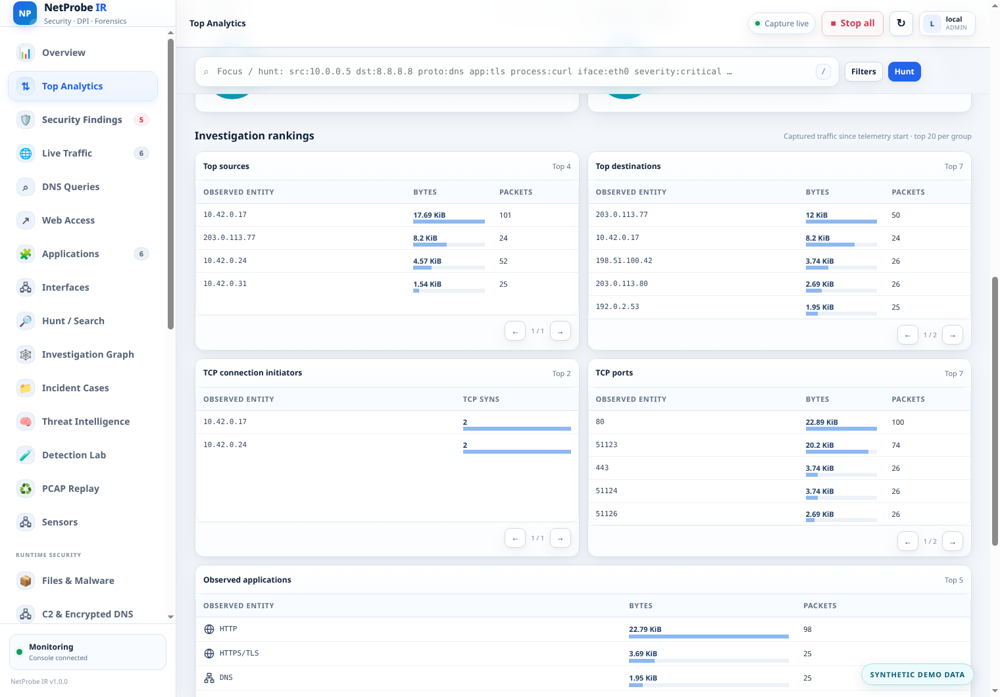
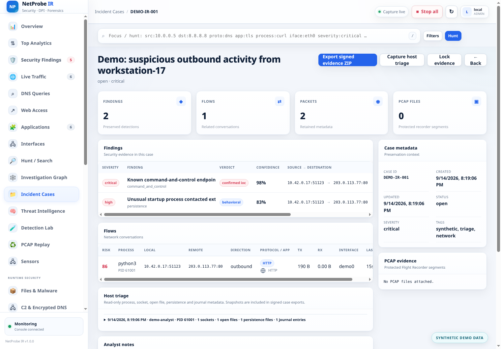

# NetProbe IR Documentation

[Türkçe](README_TR.md) · **English** · [Project README](../README.md)

This directory contains the versioned technical and operational documentation for NetProbe IR 1.0.0. English documents use the base filename; Turkish translations use the `_TR` suffix.

## Start here

- [Architecture](ARCHITECTURE.md) — capture-to-investigation data path and component boundaries.
- [Implementation status](IMPLEMENTATION_STATUS.md) — verified capabilities, conditional integrations and deliberate non-claims.
- [Security](SECURITY.md) — privileges, exposure controls, evidence handling and vulnerability reporting.
- [Testing](TESTING.md) — local, integration, browser and release verification procedures.
- [Web console design](UI_DESIGN.md) — interaction model, accessibility and evidence-oriented UI decisions.
- [Supply-chain controls](SUPPLY_CHAIN.md) — SBOM, provenance, checksums and optional signatures.

## Console previews

These are current console screenshots with synthetic demonstration data, not real incident evidence. See the [full product tour](../README.md#product-tour) for more views.

  

  

## Operations and detection

- [Authentication and SOC security](AUTH_SECURITY.md)
- [Native IDS and security findings](IDS_SECURITY.md)
- [Hunt query language](HUNT_QUERY.md)
- [Remote Syslog and flow export](EXPORT_SYSLOG_FLOW.md)

## Release architecture notes

- [v0.7 advanced analytics and extensibility](ADVANCED_V07.md)
- [v0.8.1 detection quality and root cause](ADVANCED_V081.md)
- [v0.9 interoperability and executive security](ADVANCED_V09.md)
- [v1.0 interactive investigation, notifications and live traffic](ADVANCED_V10.md)

## Release records

- [Changelog](../CHANGELOG.md)
- [Final v1.0.0 test results](../TEST-RESULTS.md)
